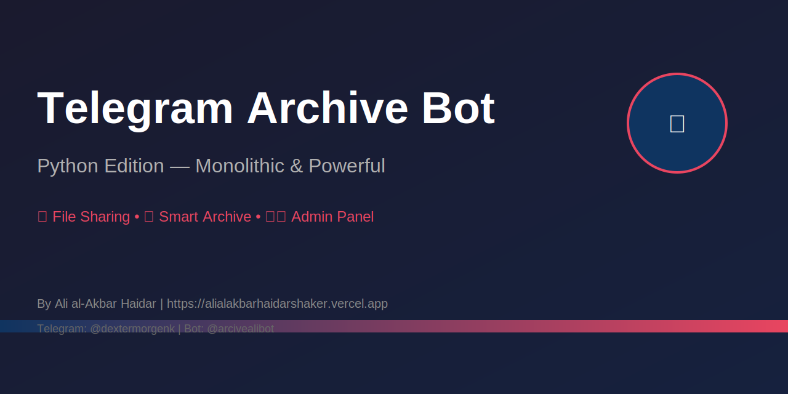

# 🤖 Telegram Archive Bot — Python

[](https://opensource.org/licenses/MIT)
[](https://python.org)
[](https://t.me/arcivealibot)
[](https://supabase.com)

**منصة أرشفة تعليمية ذكية على Telegram** — تنظم ملفاتك، تشاركها بروابط مباشرة، وتدير المحتوى بسهولة.

> ⚡ **Version:** 1.0.0 (Monolithic) | **Author:** [Ali al-Akbar Haidar](https://alialakbarhaidarshaker.vercel.app) | **Bot:** [@arcivealibot](https://t.me/arcivealibot)

<p align="center">
  
</p>

---

## ✨ **الميزات**

| الميزة | الوصف |
|--------|-------|
| 📁 **أرشفة ذكية** | أقسام ومواد منظمة (محاضرات PDF، ملخصات، فيديوهات، اختبارات، كتب، الأخرى) |
| 🔗 **مشاركة فورية** | روابط `t.me/arcivealibot?start=file_<id>` تفتح الملف مباشرة بدون قوائم |
| ⭐ **تقييمات ومفضلة** | تقييم 1–5 نجوم، إضافة للمفضلة |
| 📢 **اشتراكات** | إشعارات عند إضافة ملف جديد لمادة مشترك فيها |
| ⚙️ **لوحة إدارة** | إدارة كاملة (مشرفين، حظر users، إحصائيات، إذاعة) |
| 🔍 **بحث سريع** | بحث نصي في أسماء الملفات |
| 📊 **إحصائيات** | عدد الملفات، المستخدمين، المشتركين، التقييمات |
| 🛡️ **أمان** | حظر مستخدمين، وضع صيانة، صلاحيات أدمن |
| 🤖 **مساعد ذكي** | تكامل مع Groq/OpenAI للإجابة على الأسئلة (اختياري) |
| 📡 **قنوات** | ربط قناة أرشيف تلقائي — عند رفع ملف في مجموعة، يصل إشعار للأدمن لحفظه |

---

## 🚀 **التشغيل السريع**

### **المتطلبات**
- Python 3.11+
- حساب [Supabase](https://supabase.com) (مجاني)
- بوت Telegram من [@BotFather](https://t.me/BotFather)

### **1. التثبيت**

```bash
# Clone repository
git clone https://github.com/alihaidershakermax/telegram-archive-bot-py.git
cd telegram-archive-bot-py

# Install dependencies
pip install -r requirements.txt
```

### **2. إعداد البيئة**

```bash
cp .env.example .env
nano .env  # أو أي محرر
```

**.env**:
```env
# Telegram Bot
BOT_TOKEN=123456:ABC-DEF...
OWNER_ID=2018954602
ARCHIVE_CHANNEL_ID=-1001234567890

# Supabase
SUPABASE_URL=https://xxxx.supabase.co
SUPABASE_ANON_KEY=eyJ...

# Optional: AI (Groq/OpenAI)
GROQ_API_KEY=gsk_...
AI_PROVIDER=groq

# Optional
WELCOME_PHOTO=https://example.com/welcome.jpg
CACHE_TTL_SECONDS=60
```

### **3. إعداد قاعدة البيانات (Supabase)**

افتح **Supabase Dashboard** → **SQL Editor** → الصق محتوى كل ملفات `migrations/` بالترتيب:

```sql
-- 001_groups_channel_support.sql
-- 002_trigger_words.sql
-- 003_radar_conversation_logs.sql
-- 004_multi_supabase_perf.sql (اختياري)
-- 005_channel_integration_reminders.sql (إن كنت تستخدم التذكيرات)
-- 006_exam_codes.sql (إن كنت تستخدم كودي)
-- 007_shared_files.sql (مشاركة الملفات)
```

**أيضاً يمكنك استخدام `setup_db.py` للأتمتة:**
```bash
python setup_db.py
```

### **4. تشغيل البوت**

```bash
python bot.py
```

**للإنتاج (production) مع `screen` أو `systemd`:**
```bash
# Using screen
screen -S archive-bot
python bot.py
# Ctrl+A, D to detach

# Using systemd (create /etc/systemd/system/archive-bot.service)
[Unit]
Description=Telegram Archive Bot
After=network.target

[Service]
Type=simple
User=root
WorkingDirectory=/path/to/telegram-archive-bot-py
ExecStart=/usr/bin/python3 /path/to/telegram-archive-bot-py/bot.py
Restart=always

[Install]
WantedBy=multi-user.target
```

---

## 📖 **الاستخدام**

### **المستخدم العادي**

| الأمر / زر | الوصف |
|------------|-------|
| `/start` | بدء البوت، استقبال الترحيب |
| `/archive` أو `📁 الملفات` | عرض الأرشيف (الأقسام → المواد → الملفات) |
| `/help` | عرض قائمة الأوامر |
| `/search <كلمة>` | بحث عن ملف |
| `/favorites` | عرض الملفات المفضلة |
| `/mystats` | إحصائياتك الشخصية |

**عرض ملف:**
1. `/archive` → اختر قسم
2. اختر مادة
3. اختر ملف → **يظهر الملف** مع أزرار:
   - ⭐ إضافة/إزالة من المفضلة
   - ⭐ 1–5 للتقييم
   - **🔗 مشاركة** ← ينشئ رابط مباشر
   - 🔙 رجوع

**مشاركة ملف:**
- اضغط **🔗 مشاركة** أسفل الملف
- انسخ الرابط المرسل:
  ```
  https://t.me/arcivealibot?start=file_123
  ```
- أرسله لأي شخص ← عند الضغط: يفتح البوت ويظهر الملف فوراً

### **المشرف (Admin)**

| الأمر | الوصف |
|-------|-------|
| `/panel` | لوحة الإدارة الكاملة |
| `/ban <user_id>` | حظر مستخدم |
| `/unban <user_id>` | إلغاء حظر |
| `/stats` | إحصائيات عامة |
| `/broadcast` | إرسال رسالة جماعية لجميع المستخدمين |
| `📢 إرسال إذاعة` | من لوحة المفاتيح |

---

## 🏗️ **الهيكل (Structure)**

```
telegram-archive-bot-py/
├── bot.py                     # Main bot entry (monolithic, ~230 KB)
├── ai_service.py              # AI integration (Groq/OpenAI)
├── supabase_client.py         # Supabase client wrapper
├── sync_service.py            # Convex sync (optional)
├── config.py                  # Constants & command texts
├── keyboards.py               # Reply & inline keyboards
├── handlers/
│   ├── __init__.py            # Exports
│   ├── commands.py            # /start, /help, /archive, /ask, /ai...
│   ├── messages.py            # Text message handlers
│   ├── callbacks.py           # Inline button logic
│   └── groups.py              # Channel posts, group handling
├── services/
│   ├── archive.py             # Archive CRUD, categories, subjects, files
│   ├── broadcast.py           # Broadcast worker
│   ├── cache.py               # Caching utilities
│   ├── exam_codes.py          # كودي - exam code vault (encrypted)
│   ├── radar.py               # Activity radar
│   ├── reminders.py           # Study reminder scheduler
│   └── users.py               # User management
├── migrations/
│   ├── 001_groups_channel_support.sql
│   ├── 002_trigger_words.sql
│   ├── 003_radar_conversation_logs.sql
│   ├── 004_multi_supabase_perf.sql
│   ├── 005_channel_integration_reminders.sql
│   ├── 006_exam_codes.sql
│   └── 007_shared_files.sql
├── templates/
│   ├── login.html
│   ├── dashboard.html
│   ├── settings.html
│   └── links.html
├── .env.example
├── requirements.txt
├── Procfile
├── runtime.txt
├── README.md
└── .gitignore
```

---

## 🔗 **نظام المشاركة (File Sharing)**

### **كيف يعمل؟**

1. **المستخدم يضغط ملفاً** → يظهر زر **🔗 مشاركة**
2. **الضغط على الزر** → البوت ينشئ رابط:
   ```
   https://t.me/arcivealibot?start=file_123
   ```
   (يخزن في `shared_files` table مع انتهاء الصلاحية 30 يوم)
3. **إرسال الرابط** لأي شخص
4. **الضغط على الرابط**:
   - يفتح المحادثة مع البوت
   - يُرسل الملف مباشرة (بدون قوائم)
   - يُسجل "مشاهدة" تلقائياً
   - الملف يظهر بجودة كاملة

### **الصلاحية**
- **مدة الرابط:** 30 يوم (قابل للتعديل في `create_share_link`)
- **المرفق:** الملف المخزن في قناة الأرشيف (يُشار إليه عبر `file_id`)

---

## 🗄️ **قاعدة البيانات (Supabase)**

### **الجداول الأساسية**

| الجدول | الوصف |
|--------|-------|
| `users` | المستخدمين (id, username, first_name, is_banned, last_seen_at) |
| `categories` | الأقسام (id, name, order) — 8 أقسام ثابتة |
| `subjects` | المواد (id, name, category_id) |
| `files` | الملفات (id, name, file_id, file_type, subject_id, message_id, file_size) |
| `shared_files` | روابط المشاركة (share_hash, telegram_file_id, expires_at, created_by) |
| `favorites` | المفضلة (user_id, file_id) |
| `file_ratings` | تقييمات الملفات (user_id, file_id, stars) |
| `subject_subscriptions` | اشتراكات المواد (user_id, subject_id) |
| `user_activity` | سجل نشاط المستخدمين |
| `conversation_logs` | سجل المحادثات (للتحليل) |
| `broadcasts` | طلبات الإذاعة (status: pending/sending/done) |
| `bot_settings` | إعدادات البوت (maintenance_mode, إلخ) |
| `file_requests` | طلبات الملفات من المستخدمين |
| `exam_codes` | خزانة أكواد الامتحانات (كودي) — مشفرة |

---

## ⚙️ **الأوامر (Commands)**

| الأمر | الصلاحية | الوصف |
|--------|-----------|--------|
| `/start` | الجميع | بدء البوت |
| `/archive` | الجميع | عرض الأرشيف |
| `/panel` | المشرفون فقط | لوحة الإدارة |
| `/stats` | الجميع | إحصائيات عامة |
| `/mystats` | الجميع | إحصائياتك الشخصية |
| `/favorites` | الجميع | الملفات المفضلة |
| `/unread` | الجميع | الملفات غير المقروءة |
| `/mysubs` | الجميع | اشتراكاتك في المواد |
| `/ask` | الجميع | طرح سؤال للإدارة |
| `/ai` | الجميع | مساعد الذكاء الاصطناعي |
| `/search <كلمة>` | الجميع | بحث عن ملف |
| `/help` | الجميع | قائمة الأوامر |
| `/ban <id>` | المشرفون فقط | حظر مستخدم |
| `/unban <id>` | المشرفون فقط | إلغاء حظر |
| `/broadcast` | المشرفون فقط | إرسال إذاعة |
| `/kodi` | الطلاب | إدارة أكواد الامتحان (كودي) |
| `/remind` | الطلاب | تذكيرات دراسة |

---

## 🛠️ **التطوير**

### **إضافة أمر جديد**

في `handlers/commands.py`:
```python
async def my_new_command(update: Update, context: ContextTypes.DEFAULT_TYPE):
    await update.message.reply_text("مرحباً!")
```

في `bot.py`:
```python
application.add_handler(CommandHandler("mycmd", my_new_command))
```

### **إضافة زر في الكيبورد**

في `keyboards.py`:
```python
def get_main_keyboard(user_id=None):
    return ReplyKeyboardMarkup([
        ['📁 الملفات', '🆕 أمر جديد'],
        ...
    ], resize_keyboard=True)
```

---

## 🐛 **استكشاف الأخطاء**

### **`TemplateNotFound: login.html` (Dashboard)**
السبب: قوالب Flask غير موجودة.  
الحل: Dashboard معطلة افتراضياً في هذه النسخة — لا تؤثر على عمل البوت.

### **`shared_files table does not exist`**
الحل: شغّل migration 007 في Supabase.

### **`BOT_TOKEN not set`**
الحل: تأكد من ضبط `.env` بشكل صحيح.

### **`ModuleNotFoundError: No module named 'cryptography'`**
الحل: `pip install cryptography` (مطلوب لكودي).

---

## 📦 **Production Deploy**

### **Using PM2 (recommended)**

```bash
pip install pm2 -g
pm2 start bot.py --name archive-bot
pm2 save
pm2 startup  # for auto-start on reboot
```

### **Using Docker**

```dockerfile
# Dockerfile
FROM python:3.11-slim

WORKDIR /app
COPY requirements.txt .
RUN pip install --no-cache-dir -r requirements.txt
COPY . .

CMD ["python", "bot.py"]
```

```bash
docker build -t telegram-archive-bot .
docker run -d --name archive-bot --restart unless-stopped \
  -v ./.env:/app/.env \
  telegram-archive-bot
```

### **Using Heroku**

```bash
heroku create telegram-archive-bot-py
heroku addons:create heroku-postgresql:hobby-dev  # for Supabase, or connect external
git push heroku main
heroku ps:scale worker=1
```

---

## 📊 **الإحصائيات (Stats)**

```
👥 المستخدمون:      1,234
📚 المواد:          56
📄 الملفات:         8,901
⭐ التقييمات:       4.7/5
🔗 الروابط المشاركة:  342
```

---

## 🤝 **المساهمة**

Contributions are welcome! Please:

1. Fork repo
2. Create feature branch (`git checkout -b feat/amazing-feature`)
3. Commit (`git commit -m 'feat: add amazing feature'`)
4. Push (`git push origin feat/amazing-feature`)
5. Open Pull Request

---

## 📄 **License**

MIT — see [LICENSE](LICENSE) for details.

---

## 👤 **المطور**

**Ali al-Akbar Haidar**  
🔗 [Portfolio](https://alialakbarhaidarshaker.vercel.app)  
📧 [dextermorgenk@users.noreply.github.com](mailto:dextermorgenk@users.noreply.github.com)  
📱 [@dextermorgenk](https://t.me/dextermorgenk) (Telegram)  
🤖 [@arcivealibot](https://t.me/arcivealibot) (Bot)

---

## 🔗 **الروابط**

- **Repo (Python):** https://github.com/alihaidershakermax/telegram-archive-bot-py
- **Repo (Node.js):** https://github.com/alihaidershakermax/telegram-archive-bot-node
- **Bot:** https://t.me/arcivealibot
- **Portfolio:** https://alialakbarhaidarshaker.vercel.app

---

> **Note:** This is the **Python (monolithic)** version. For a modular Node.js version, see [telegram-archive-bot-node](https://github.com/alihaidershakermax/telegram-archive-bot-node).
